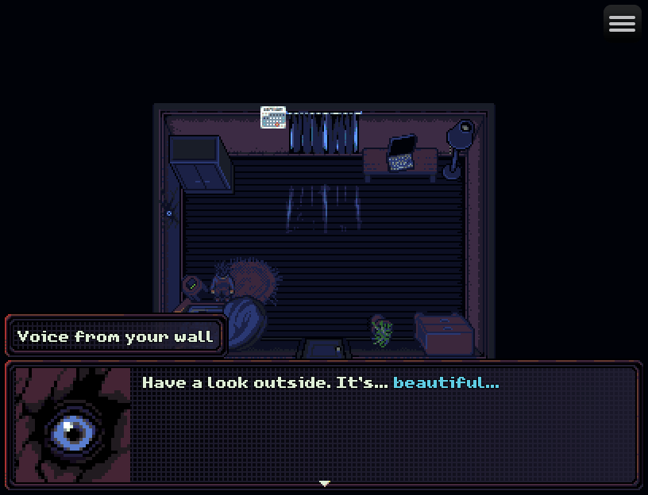
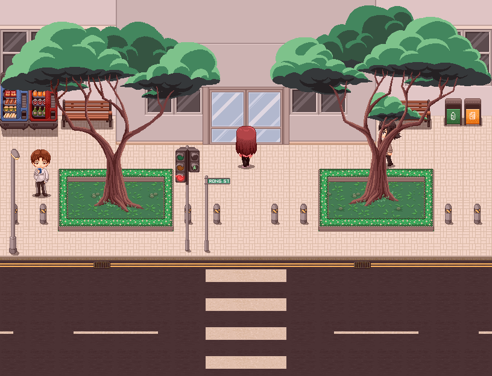
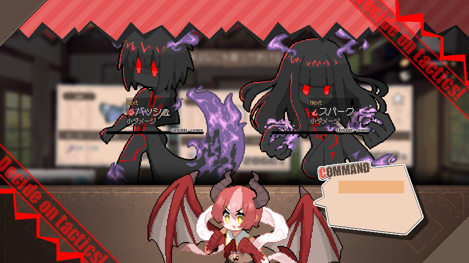
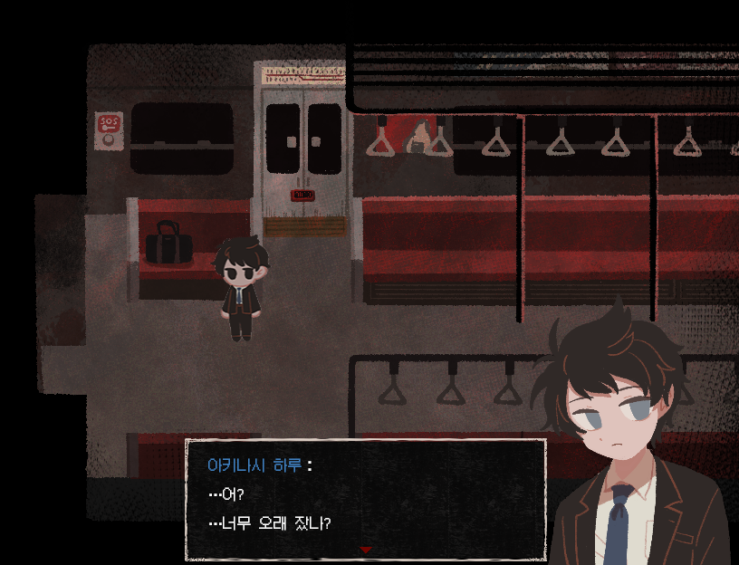
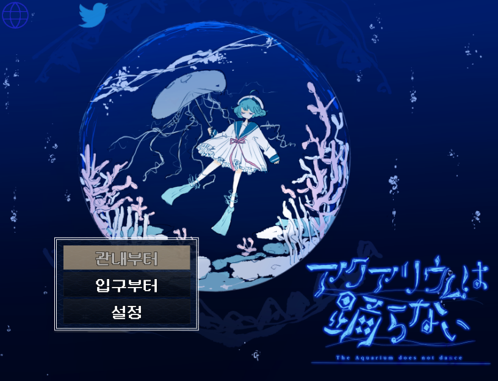
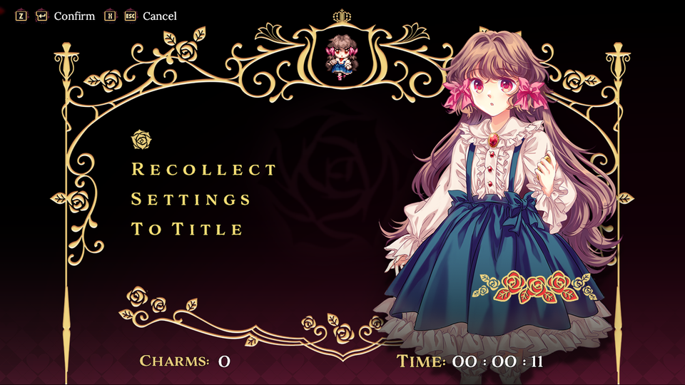

# Outsider: RPG Maker MZ Native Runtime

Outsider is a native, browser-free runtime for RPG Maker MZ games. The game's original
JavaScript runs unmodified inside [QuickJS](https://github.com/quickjs-ng/quickjs),
with windowing and input from SDL3, rendering through OpenGL, and audio through
SoLoud. No NW.js, no Chromium, no Node.

The result is a small executable (a few megabytes instead of a couple hundred)
that starts instantly, uses far less memory than the stock NW.js player, and
runs on Linux and Windows from the same source tree.

## Features

- **Unmodified game code.** Drop in a standard RPG Maker MZ project directory;
  `rmmz_core.js`, plugins and `main.js` load exactly as shipped.
- **Browser API shim layer.** DOM, Canvas 2D, PIXI.js, Web Audio,
  XMLHttpRequest, `localStorage`/`localforage`, `document.fonts`, gamepads,
  fullscreen, timers and `requestAnimationFrame` are provided in JavaScript
  and backed by native C.
- **GPU rendering.** Sprite batching, render targets, blend modes, tilemap
  layers and PIXI filters (ColorMatrix, Blur, Alpha) on OpenGL 4.5.
- **Software Canvas 2D** for `Bitmap` operations (text, gradients, paths,
  transforms) with TrueType text via stb_truetype, including per-glyph
  fallback to the game's other fonts and then to system fonts, so text in a
  script the chosen font does not cover still renders.
- **Audio** through SoLoud: OGG Vorbis and WAV, four independent buses
  (BGM, BGS, ME, SE), streaming for music, pitch and pan.
- **Movies** (title videos, the Play Movie command) through a built-in
  MPEG-1 decoder (pl_mpeg); the packaging tools transcode the game's
  WebM/MP4 files (see [Movies](#movies)).
- **Plugin friendly.** Common plugin needs such as `document.currentScript`,
  `fetch()`, `<script>` elements inserted at run time, Steam/Greenworks
  stubs, Web Audio effect nodes and PIXI filter stubs are covered.
- **Save data compatible.** Saves are written next to the game exactly where
  the NW.js player puts them.
- **Effekseer** particle effects through the native SDK (optional build).
- **Packaging tools** that decrypt assets, convert audio and bundle a
  self-contained distribution.

## Tested Games

Commercial RPG Maker MZ games from Steam, run unmodified from their converted
assets. All screenshots below are Outsider, not the original player.

<table>
  <tr>
    <td align="center"><br><b>Look Outside</b></td>
    <td align="center"><br><b>Ann</b></td>
  </tr>
  <tr>
    <td align="center"><br><b>DRAPLINE Demo</b></td>
    <td align="center"><br><b>Saihate Station</b></td>
  </tr>
  <tr>
    <td align="center"><br><b>The Aquarium does not dance</b></td>
    <td align="center"><br><b>Pocket Mirror ~ GoldenerTraum</b></td>
  </tr>
</table>

| Game | Core | What it exercises |
|------|------|-------------------|
| **Look Outside** | 1.8.1 | Encrypted assets, a large plugin set, battles, autosave, plugin-defined scenes |
| **Ann** | 1.2.0 | WOFF/OTF fonts, title and cutscene movies, VisuStella plugins, screen tints, `%`-encoded and `..` asset paths |
| **DRAPLINE Demo** | 1.9.0 | 1920x1080, 216 plugins, 386 preloaded APNG pictures, HTML name-entry dialog, textured `PIXI.Graphics` fills, encounter effects, fullscreen-at-boot plugin |
| **Saihate Station** | 1.8.1 | Third-party asset encryption (Art Encrypter), UTF-8 BOM data files, pre-title map with language selection, Korean and Japanese text |
| **The Aquarium does not dance** | 1.5.0 | FOSSIL (an MV compatibility layer that replaces `main.js` through an injected `<script>`), 98 plugins, Japanese menu text rendered through system-font fallback |
| **Pocket Mirror ~ GoldenerTraum** (demo) | 1.6.0 | 1280x720, VisuStella suite with GSAP-animated menus, sprite masks, Steam/Greenworks calls, plugins in subfolders, JPEG data stored under a `.png` name |

Each game is run scene by scene against its own NW.js player with the
[visual evaluator](#visual-evaluator): title, options, load, map, every menu
scene, message window, shop, name entry and battle. Across these games the
compared scenes differ from the original by 0 to 4% of pixels, almost all of
it font anti-aliasing (Chrome hints glyphs, stb_truetype does not) and the
phase of animations that run on a wall clock. Gameplay flow through a battle
was verified frame by frame where the game has one.

A game whose own boot flow or menus need different handling gets its own
step list; `tools/evaluator/scenarios/pocket-mirror.json` is one, for a game
that shows a splash and a language screen before the title and animates its
menus into place.

## How It Works

```
RPG Maker MZ game (unmodified JS)
        |
Browser API shims (src/shims/*.js)
        |
QuickJS C bindings (src/bindings/)
        |
Native backends: SDL3 GPU (OpenGL fallback), SoLoud, Effekseer
```

The runtime behaves like a purpose-built browser. Scripts are loaded in the
same order `index.html` would load them: shims, `pako`, the `rmmz_*` core
files, plugins, then `main.js`. Every browser object the engine touches is
either implemented in a shim or forwarded to a native function registered
under a `__native_*` name.

## Requirements

- CMake 3.20 or newer
- A C17 and C++ compiler: GCC, Clang, or Visual Studio 2022
- OpenGL 4.5 capable GPU and driver (direct state access is used throughout)
- Python 3.8+ for the packaging tools
- `ffmpeg` on `PATH` (or in `RMMZ_FFMPEG`), only if the game ships M4A
  audio or movies

SDL3, QuickJS-NG and SoLoud are fetched and built from source by CMake.
stb_image and stb_truetype are vendored under `third_party/stb`.

## Building

### Linux / macOS-style shells

```bash
cmake -S . -B build -DCMAKE_BUILD_TYPE=Release
cmake --build build --parallel
ctest --test-dir build
```

### Windows (Visual Studio 2022)

Install the "Desktop development with C++" workload. Then either use Ninja from
a *x64 Native Tools Command Prompt for VS 2022*:

```bat
cmake -S . -B build -G Ninja -DCMAKE_BUILD_TYPE=Release
cmake --build build --parallel
ctest --test-dir build
```

or the Visual Studio generator from any prompt:

```bat
cmake -S . -B build -G "Visual Studio 17 2022" -A x64
cmake --build build --config Release --parallel
ctest --test-dir build -C Release
```

On Windows `outsider.exe` is a GUI application: no console window opens
when it is double-clicked. Output still reaches the parent console when
launched from a shell, follows redirection, and otherwise goes to
`console.log` next to `debug.log` in the game directory. Fatal startup errors
are shown in a message box. Pass `-DRMMZ_WIN32_CONSOLE=ON` to build a
console executable instead.

### CMake options

| Option | Default | Description |
|--------|---------|-------------|
| `CMAKE_BUILD_TYPE` | Debug | Debug, Release, RelWithDebInfo, MinSizeRel |
| `RMMZ_BUILD_TESTS` | ON | Build the test suite |
| `RMMZ_RENDER_BACKEND` | gpu | Rendering backend: `gpu` (SDL3 GPU) or `gl` (OpenGL 4.5) |
| `RMMZ_RUNTIME_SHADERS` | ON | Compile game-supplied shaders at run time (GPU backend only) |
| `RMMZ_DEFAULT_WIDTH` / `RMMZ_DEFAULT_HEIGHT` | 816 / 624 | Initial window size |
| `RMMZ_USE_EFFEKSEER` | OFF | Build the real Effekseer backend (stub otherwise) |
| `RMMZ_WIN32_CONSOLE` | OFF | Windows: console subsystem instead of GUI |
| `RMMZ_GAME_DIR` | (empty) | Game directory to bundle with `cmake --install` |
| `RMMZ_TEST_GAME_DIR` | (empty) | Real game used by the integration tests (optional) |

### Rendering backends

The runtime renders through SDL3's GPU API by default, with the original
OpenGL 4.5 path kept as a fallback:

```bash
cmake -B build                             # SDL3 GPU: D3D12 or Vulkan (default)
cmake -B build -DRMMZ_RENDER_BACKEND=gl    # OpenGL 4.5 fallback
```

Both produce the same image. `tools/compare_backends.py` runs a scenario
through two builds and diffs the screenshots; across Look Outside, Saihate
Station, Aquarium and DRAPLINE every shot is pixel-identical, filters, masks,
render textures and the HTML overlay included.

The GPU backend keeps `renderer.h`, `sprite_batch.h` and `filters.h`
unchanged, so the shims, bindings and tests are shared. Three things follow
from SDL3 having no immediate mode:

- **Draws are recorded, then replayed.** A copy pass cannot run while a render
  pass is open, so vertices are gathered into one arena and uploaded once per
  frame, then the recorded commands are replayed. Readbacks (`Bitmap.snap`,
  screenshots) flush that queue first.
- **Frames are composed offscreen.** No graphics API guarantees the image being
  presented can be read back — SDL3 says so outright, and Metal and Vulkan
  agree — so both backends draw into an offscreen surface and blit it to the
  window in `renderer_present`. Screenshots then mean the same thing
  everywhere, and rendering does not depend on the window being visible.
- **Built-in shaders are bytecode.** `src/rendering/shaders/*.hlsl` is compiled
  ahead of time by `tools/compile_shaders.py` into `shaders_generated.h`, which
  is checked in, so building needs no shader compiler.

### Shaders a game brings with it

RPG Maker plugins may create PIXI filters with their own GLSL. That GLSL is
written for WebGL 1 — `varying`, `texture2D`, `gl_FragColor`, loose `uniform`
declarations — which neither a modern OpenGL core profile nor SDL3 accepts, so
these filters were silently drawn unfiltered.

With `RMMZ_RUNTIME_SHADERS` (on by default for the GPU backend) they are
rewritten by `src/rendering/glsl_translate.c` and compiled on the fly:

```
plugin GLSL ES -> glsl_translate -> glslang -> SPIR-V -> SDL_shadercross -> device format
```

The rewrite is declaration-only: the shader's own statements are never edited.
Loose uniforms move into an *anonymous* block, so their names stay global and a
local may still shadow them; uniform offsets are recorded so the JS side can go
on setting them by name; and a vertex stage is generated per shader, because a
pipeline is only valid when it writes every input the fragment stage declares.

This adds roughly 4 MB to the binary and ships no redistributable compiler:
D3D12 is reached through DXBC, which Windows' own `d3dcompiler` produces.
Anything the rewrite cannot express still falls back to drawing unfiltered.
Build with `-DRMMZ_RUNTIME_SHADERS=OFF` to leave the compiler out entirely.

`tools/compile_shaders.py` emits all three formats through
[SDL_shadercross](https://github.com/libsdl-org/SDL_shadercross), which knows
the resource-binding rules each backend expects:

| Platform | Backend | Shader format |
|----------|---------|---------------|
| Windows | D3D12 | DXIL |
| Linux | Vulkan | SPIR-V |
| macOS | Metal | MSL |

The generated header is checked in, so only editing a shader needs the tool.
Configuring the GPU backend on a platform whose format is missing from that
header fails at CMake time with a message pointing back here, rather than
building a runtime that cannot create a device.

## Usage

```bash
# Run a game (positional or --game); shims default to src/shims
./build/outsider "/path/to/game"
./build/outsider --game "/path/to/game" --shims "/path/to/shims"

# Other options
./build/outsider --game "/path/to/game" --resolution 1280x720 --no-audio

# Debugging aids: stop after N frames with a screenshot and a JS probe,
# or take commands from stdin (used by tools/visual_eval.py)
./build/outsider "/path/to/game" --frames 300 --screenshot out.ppm --probe "SceneManager._scene.constructor.name"
./build/outsider "/path/to/game" --control
```

The game directory is a normal RPG Maker MZ project: `js/`, `data/`, `img/`,
`audio/`, `fonts/`. With no arguments the runtime looks for a `game/` folder
next to the executable, and for shims in `game/shims/` or `shims/` beside it.
This is the layout produced by the packaging tool, so a packaged build runs
on double-click.

The window title shows `<game title> [Outsider]` from `System.json`.
Logs are written to `debug.log` in the game directory. Saves go to
`save/` in the game directory, matching the stock player.

### Packaging a distribution

```bash
# Convert assets, build the runtime, and assemble dist/
python3 tools/build_game.py "/path/to/game" --output-dir dist --build-type Release

# Individual steps
python3 tools/resource_converter.py "/path/to/game" out/   # assets only
python3 tools/build_game.py "/path/to/game" --skip-compile  # assets + shims
python3 tools/build_game.py "/path/to/game" --skip-assets   # compile only
```

`resource_converter.py` decrypts `.png_`/`.ogg_` files using the key in
`System.json`, converts M4A to OGG and transcodes `movies/` to MPEG-1 when
`ffmpeg` is available, and drops NW.js
binaries, browser-only files and JS libraries that the runtime replaces
natively (PIXI, Effekseer WASM, vorbis decoder). `build_game.py` then copies
the shims into `dist/game/shims/`, builds the runtime and places the
executable at `dist/`.

### Movies

RPG Maker MZ ships every movie twice, as `movies/<name>.webm` and
`movies/<name>.mp4`, and plays them through the browser's video element.
Outsider has no browser codecs; it plays MPEG-1 video with MP2 audio through
the vendored `pl_mpeg` decoder, a single-file software decoder with no
external dependencies. So the game's movies are transcoded once at packaging
time:

- `resource_converter.py` finds each movie stem under `movies/`, prefers the
  `.webm` when both files exist, and writes `movies/<name>.mpg` with

  ```
  ffmpeg -y -i <src> -vf scale=trunc(iw/2)*2:trunc(ih/2)*2 \
         -c:v mpeg1video -q:v 4 -bf 0 \
         -c:a mp2 -b:a 192k -ar 44100 -ac 2 -f mpeg <dst>
  ```

  (odd frame sizes are rounded down to even, as MPEG-1 requires; a source
  whose frame rate MPEG-1 does not allow is retried at 30 fps).
- ffmpeg is taken from `PATH`, or from the `RMMZ_FFMPEG` environment
  variable when set to the executable's path. Without it the converter
  reports the movies as errors and everything else still converts.
- At run time the video shim maps whatever URL the game requests
  (`movies/intro.webm`, `.mp4`, `.ogv`) to the `.mpg` next to it. A movie
  with no `.mpg` is skipped: the game receives `loadeddata` and `ended`
  events a moment later and carries on.
- Playback is drawn letterboxed over the game area after the frame; audio
  goes through its own SoLoud stream. Video time follows the wall clock, so
  a movie of the same length takes the same time as in the original player.

To check a converted movie, play it with any MPEG-1 capable player, or run
the game with `--frames 600 --screenshot out.ppm` past the point where it
starts.

## Architecture

```
src/
  main.c                  Entry point, argument parsing, subsystem init
  platform/
    platform_sdl2.c       Window, OpenGL context, events, gamepads
    win_console.c         Windows stdout/stderr handling and error dialogs
  engine/
    js_engine.c           QuickJS runtime, console, promise jobs, bytecode cache
    game_loop.c           Fixed-step loop: events -> timers -> rAF -> render
    script_loader.c       RPG Maker MZ script load order and plugin list
    error_handler.c       Structured logging, JS exception reporting
  io/file_io.c            Portable file system access rooted at the game dir
  rendering/
    gl_loader.c           Runtime OpenGL entry point loading
    renderer.c            Frame orchestration, render targets, blend state
    sprite_batch.c        Quad batching (VAO/VBO, texture sorting)
    canvas2d.c            Software Canvas 2D rasteriser
    font_manager.c        TrueType loading and glyph caching
    image_loader.c        PNG/JPEG decoding and texture cache
    tilemap.c             Tilemap layer rendering (autotiles, animation)
    filters.c             GLSL implementations of PIXI filters
  audio/audio_engine.cpp  SoLoud wrapper with four mix buses
  effects/effekseer_backend.cpp
  input/input_manager.c   SDL events -> DOM keyboard/mouse/gamepad state
  bindings/bind_*.c       QuickJS registrations, one module per subsystem
  shims/*.js              Browser API implementations loaded before the game
tests/                    Unit and integration tests (ctest)
tools/                    Packaging scripts
third_party/              Dependency fetching (CMake FetchContent) + vendored stb
```

### Shims

| File | Provides |
|------|----------|
| `dom_shim.js` | `window`, `document`, elements, events, timers, `requestAnimationFrame` |
| `canvas2d_shim.js` | `CanvasRenderingContext2D` backed by the native rasteriser |
| `pixi_shim.js` | PIXI application, containers, sprites, textures, render textures, renderer |
| `tilemap_shim.js` | Native `Tilemap` layer rendering (loaded after the core scripts) |
| `webaudio_shim.js` | `AudioContext`, buffers, gain nodes, `decodeAudioData` |
| `xhr_shim.js` | `XMLHttpRequest` over native file I/O |
| `storage_shim.js` | `localStorage`, `localforage`, `require("fs")`, `require("path")`, `process` |
| `font_shim.js` | `FontFace`, `document.fonts` |
| `dom_overlay.js` | Draws HTML forms, inputs and buttons that plugins append to `document.body` (name-entry dialogs) and routes keyboard, text and mouse input to them |
| `navigator_shim.js` | `navigator`, `getGamepads()`, `screen` |
| `plugin_compat.js` | `fetch()`, PIXI filter stubs, Steam stubs, polyfills |
| `effekseer_shim.js` | `effekseer` context API over the native backend |

### Third-party dependencies

| Library | Purpose |
|---------|---------|
| SDL3 3.4 | Window, rendering (OpenGL context or GPU API), input, audio device |
| glslang, SPIRV-Cross, SDL_shadercross | Compiling game-supplied shaders at run time (optional) |
| QuickJS-NG 0.9 | JavaScript engine |
| SoLoud | Audio mixing, OGG/WAV decoding |
| Effekseer 1.70e | Particle effects (optional) |
| stb_image, stb_truetype | Image decoding, font rasterisation |

## Plugin Compatibility

Most plugins that only use the RPG Maker MZ API work as-is. The shim layer
additionally provides the browser features plugins commonly reach for:
`document.currentScript` for parameter parsing, `fetch()`, `Array.contains`,
PIXI filter classes and Greenworks/Steam objects that report Steam as
unavailable. Known limitations:

- PIXI filter stubs beyond ColorMatrix, Blur and Alpha accept their
  parameters but do not produce a visual effect.
- QuickJS rejects assignment to a static class field defined with a getter
  only; the affected plugin logs a "no setter for property" error and
  continues.
- M4A audio must be converted to OGG and movies to MPEG-1 (the packaging
  tool does both with `ffmpeg`, see [Movies](#movies)). A movie with no
  `.mpg` next to it is skipped rather than played.

## Testing

```bash
ctest --test-dir build                      # all tests
ctest --test-dir build -R file_io -V        # one test, verbose
```

Tests use only fixtures under `tests/fixtures/` and a temporary directory.
Three tests can additionally exercise a real game (plugin loading, `pako`,
and an end-to-end acceptance pass); point `RMMZ_TEST_GAME_DIR` at an RPG
Maker MZ project at configure time to enable them, otherwise they skip.
The packaging and evaluator tools have their own tests:
`python tests/test_build_pipeline.py` and `python tests/test_visual_eval.py`.

### Visual evaluator

`tools/visual_eval.py` compares how a game looks in its own NW.js player
and in Outsider. It launches both, plays the same scenario in each (title,
options, a new game, every menu scene, a message window, shop, name entry,
a battle), screenshots each scene at the same game frame and writes a
report with side-by-side images, the differing regions and a verdict per
scene (needs Pillow):

```bash
python tools/visual_eval.py "C:/Program Files (x86)/Steam/steamapps/common/Ann/Ann"
# -> build/eval/Ann/report.html, report.json, original/, outsider/, diff/
```

The original is driven through the Chrome DevTools Protocol
(`--remote-debugging-port`); Outsider through `--control`, which reads
eval/screenshot commands on stdin. A JS prelude injected into both before
the first frame seeds `Math.random`, ignores saved config and save files,
keeps the window at the game's resolution and advances the game only while
a step runs, so screenshots are frame-exact on both sides. Encrypted games
are converted into `build/games/<name>` automatically; a game-specific step
list can be given with `--scenario` (see `tools/evaluator/scenario.py` for
the format), and `--skip-original` reuses the original's screenshots while
iterating on the runtime.

## Authors and License

Outsider is developed by [General Arcade](https://generalarcade.com). Written by Gennadii Potapov;
see [AUTHORS](AUTHORS).

Dual-licensed: [GPLv3 or later](LICENSES/GPL-3.0.txt) for free and open
source use, or a [commercial license](LICENSES/COMMERCIAL.md) from General
Arcade for proprietary and commercial projects (contact@generalarcade.com).
See [LICENSE](LICENSE).

Contributions are welcome under the terms in [CONTRIBUTING.md](CONTRIBUTING.md).
